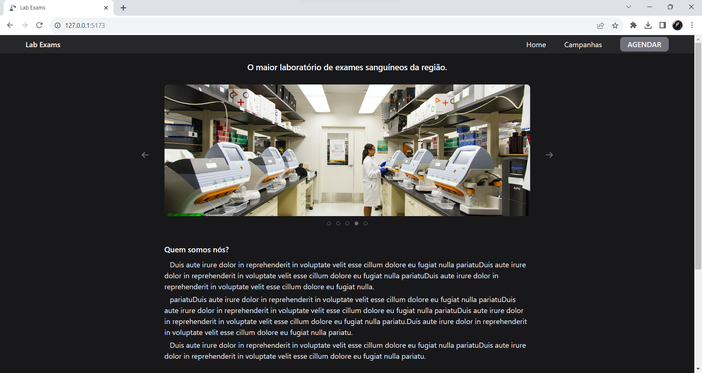
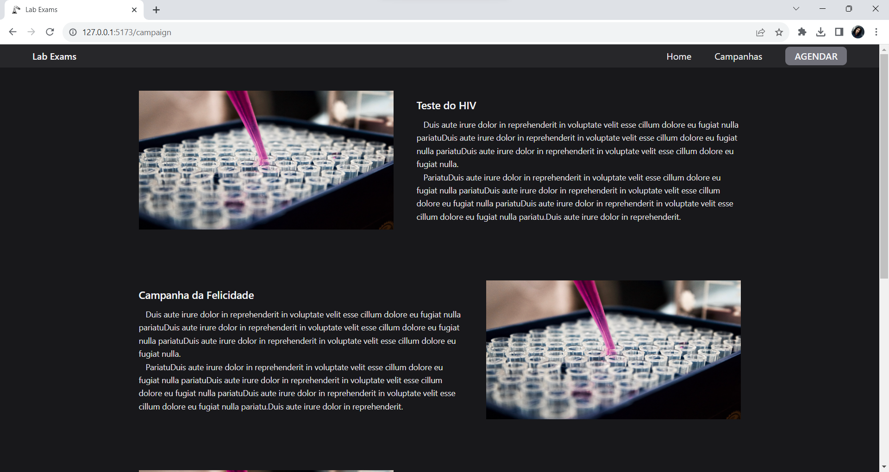
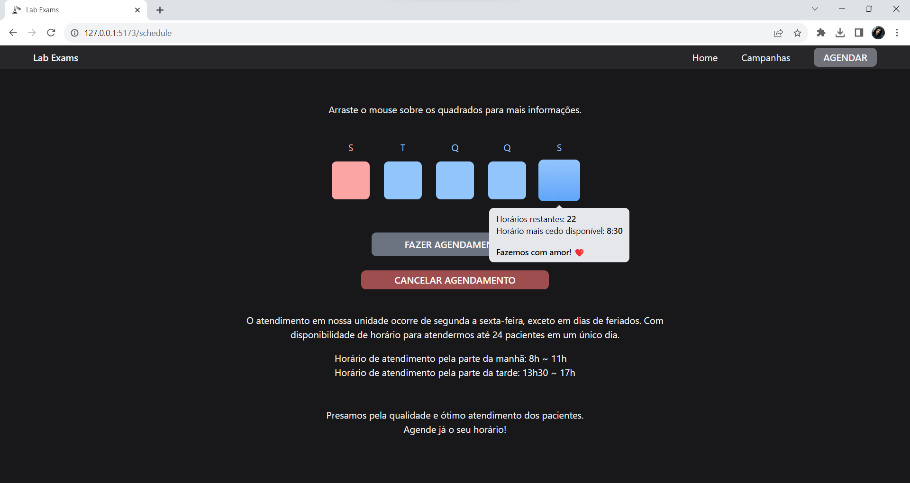
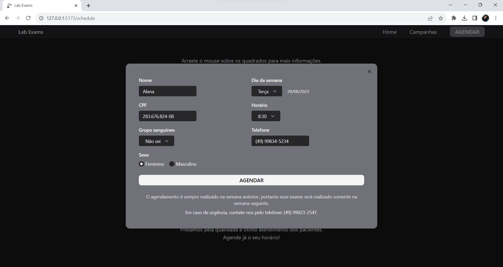
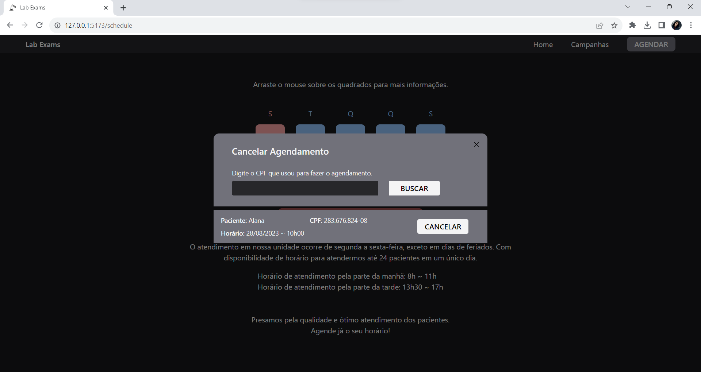

<h1 align="center">
    Lab exams
</h1>

## Sobre

Lab Exams é uma aplicação desenvolvida utilizando React, Typescript, React Query, Tailwind CSS e a biblioteca de componentes Radix UI.

A aplicação consiste em um site web que tem como finalidade fazer o cadastro de um agendamento para coleta de sangue. Apresenta uma área de informação para mostrar quantos agendamentos ainda restam em determinado dia e também permite que o paciente cancele o seu exame caso haja algum imprevisto.

<div align="center">
    
    
    
    
    
</div>

## 📋 Requisitos

Antes de iniciar, você deve ter o Node.js e o NPM instalados em sua máquina.

## 💻 Instalação

1. Clonar repositório

```bash
 git clone https://github.com/tandii/lab_exams_web.git
```

2. Entrar na pasta do projeto

```bash
 cd lab_exams_web
```

3. Instalar dependências

```bash
 npm install
```

4. Executar o projeto

```bash
 npm run dev
```

## 🫂 Integração com Backend

Para realizar a integração com o Backend, você pode clonar o projeto e rodar localmente.

- [Repositório Backend - lab_exams_server](https://github.com/tandii/lab_exams_server)

## 📝 Licença

MIT License © [Tandi Coelho](https://github.com/tandii)